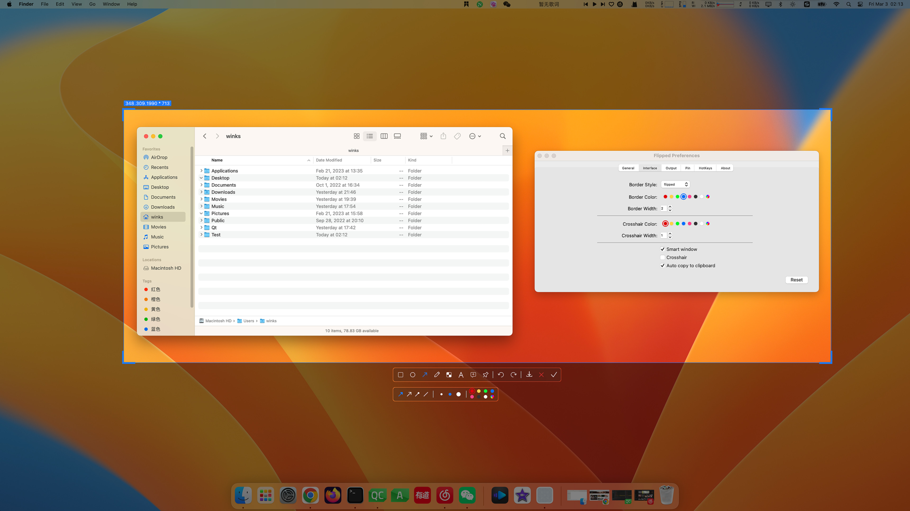
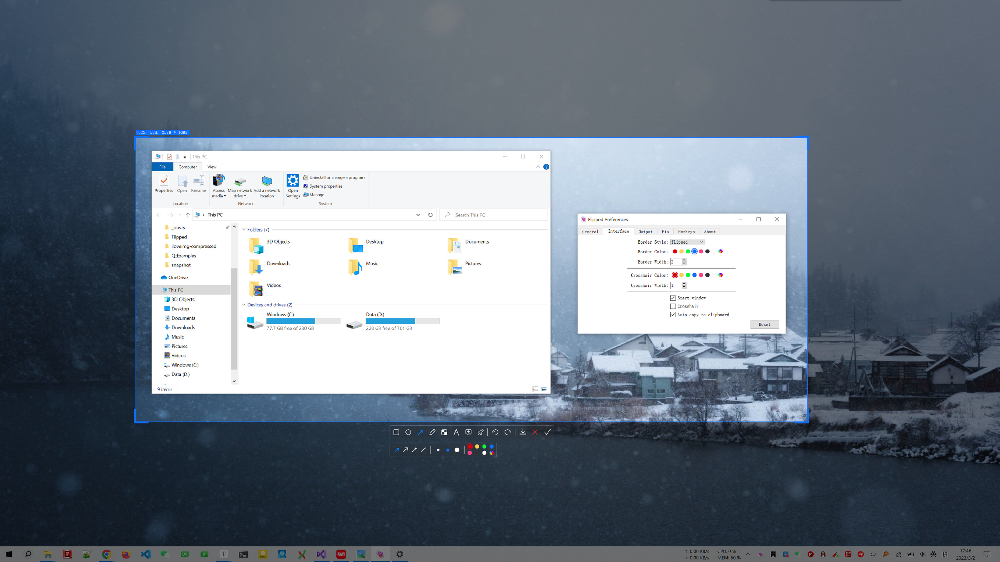
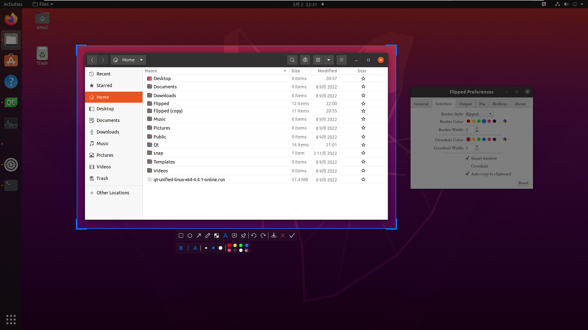

  

      <h1>
      
       
      FLIPPED
    </h1>
     
    <h4>Simple and beautiful screenshot software tool for Windows, MacOS and Linux</h4>
    <h4>简洁且漂亮的截图的软件工具，支持 Windows，MacOS，Linux 平台</h4>
    <h4>簡潔且漂亮的截圖的軟件工具，支持 Windows，MacOS，Linux 平臺</h4>
  

  

    
    
  
  

## Preview

**MACOS:**

**WINDOWS:**

- **LINUX:**

- **Other:**

More snapshoot effects can be → [here](https://github.com/XMuli/FILPPED/tree/master/snapshot) preview

## Features

**Celebrate with the release of the official version v1.3.0!** 🎉🎉🎉🎊🎊🎊

- Multi-screen screenshot, time-lapse screenshot, custom screenshot
- Pinning the picture
- Intelligent window recognition（Windows & Linux）
- Draw Rectangle, Ellipse, Arrow, Custom Path, Mosaic, Text, Serial Number
- Undo, Redo (multi-level), Save, Cancel, Copy
- Plugin Framework
- Update ... 

## Voide

- [P1] [FLIPPED-MACOS operation demonstration](https://www.bilibili.com/video/BV1rX4y1D7EZ?p=1)
- [P2] [FLIPPED-WINDOWS operation demonstration](https://www.bilibili.com/video/BV1rX4y1D7EZ?p=2)
- [P3] [FLIPPED-LINUX (ubuntu 20.04) operation demonstration](https://www.bilibili.com/video/BV1rX4y1D7EZ?p=3)

 

## Keyboard shortcuts

| Keys                                                         | Description                     | Mode   |
| ------------------------------------------------------------ | ------------------------------- | ------ |
| <kbd>←</kbd>, <kbd>↓</kbd>, <kbd>↑</kbd>, <kbd>→</kbd> ( <kbd>A</kbd>, <kbd>S</kbd>, <kbd>W</kbd>, <kbd>D</kbd> ) | Move selection 1px              | Local  |
| <kbd>Ctrl</kbd> + <kbd>←</kbd>, <kbd>↓</kbd>, <kbd>↑</kbd>, <kbd>→</kbd> | Extended selection 1 px         | Local  |
| <kbd>Alt</kbd> + <kbd>←</kbd>, <kbd>↓</kbd>, <kbd>↑</kbd>, <kbd>→</kbd> | Shrink selection 1 px           | Local  |
| <kbd>Shift</kbd> + <kbd>←</kbd>, <kbd>↓</kbd>, <kbd>↑</kbd>, <kbd>→</kbd> | Move selection 10 px            | Local  |
| <kbd>Shift</kbd> + <kbd>Ctrl</kbd> + <kbd>←</kbd>, <kbd>↓</kbd>, <kbd>↑</kbd>, <kbd>→</kbd> | Extended selection 10 px        | Local  |
| <kbd>Shift</kbd> + <kbd>Alt</kbd> + <kbd>←</kbd>, <kbd>↓</kbd>, <kbd>↑</kbd>, <kbd>→</kbd> | Shrink selection 10 px          | Local  |
| <kbd>Shift</kbd> + <kbd>F4</kbd>                             | Quick Save Image                | Local  |
| <kbd>Esc</kbd>                                               | Quit                            | Local  |
|                                                              |                                 |        |
| <kbd>F6</kbd>                                                | Window activation capture scree | Global |
| <kbd>F7</kbd>                                                | Time-lapse screen capture       | Global |
| <kbd>F8</kbd>                                                | Full screen capture screen      | Global |

## Great

If it helps you, or find it useful,  **you can click on the item's ⭐Star 🍴 Fork  of the two icons, conveniently lift the hand between, said a point of praise the hand,** There is a fragrance in your hand；The next best thing is to buy me a cold Coke.  

    
 <b>Of course you can also give a cold Coke [Donate/Reward ← Click to expand QR code]</b>

  
 - If you have something to learn from the project, you can also invite me to share a glass of Fat House Ice and Coke. - 

  <pre></pre>

## Feedback

How to Feedback ? You are very welcome to join us! You can [open an issue](https://github.com/XMuli/FILPPED/issues) ; for any bug, suggestion, feature idea, or to help improve this software.

## Author

xmulitech@gmail.com    |    https://github.com/XMuli/FILPPED

 

## Series Address

[QtExamples](https://github.com/XMuli/QtExamples) Welcome `star` ⭐ and `fork` 🍴 to this series of `C++ / QT / DTK` studies, with a table of contents for learning from the beginning to the end

